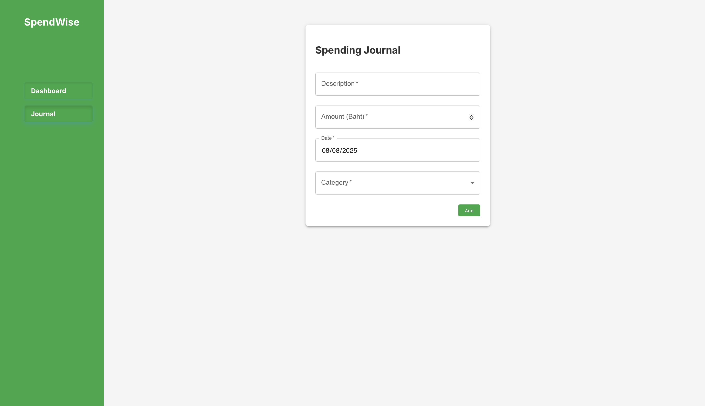

# SpendWise: A Simple Spending Tracker
 **Members** 
 - NYUNT TIN
 - PYAE PHYO NANDAR OO
 - PHANTHIRA KOSITJAROENKUL
 
## Project Objective
 
SpendWise is a web application designed to help you easily track your daily expenses. The goal is to provide a clean and simple interface for logging and visualizing your spending history, allowing for better financial awareness.

---

**Features**
 
**Spending Journal** - Add and manage your expenses with details like **description**, **amount**, **date**, and **category**. Enter your **customized Category**in "Other".

**Dashboard Overview** - View a summary of your total spending.
**Visual Charts** - See an interactive **line chart & pie chart** of your expenses.  
**Filter & Sort** - Filter your spending by **month** or **category**, and **sort** your transactions by **date**.
 **Search Functionality** - Find specific transactions by searching for keywords.
**Local Storage** - Your spending data is saved directly in your browser using local storage, so your information persists even after you close the tab.
 
---

## Screenshots

### Dashboard View

### Spending Journal

---

**Tech Stack**

- React.js 
- Recharts 
- Material-UI (MUI) 
- LocalStorage 
- Vite 
- Deployment: GitHub Pages (via pnpm run deploy)

---